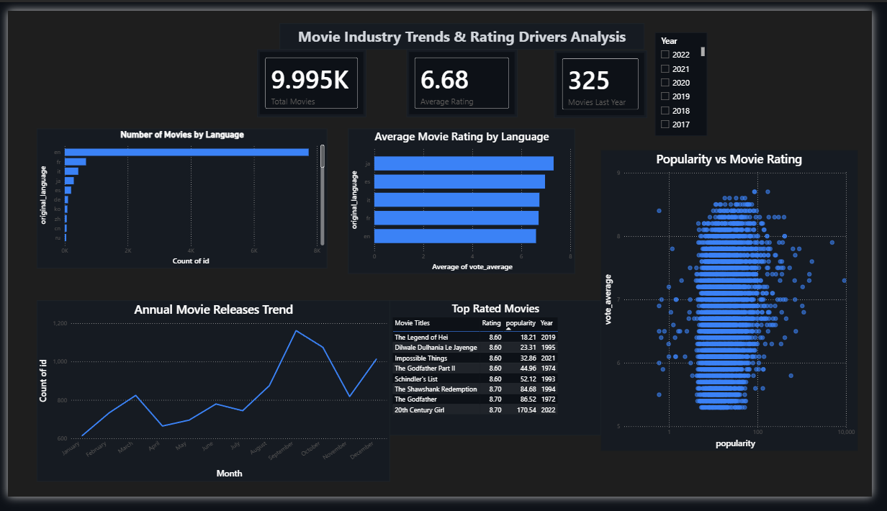

# Movie Industry Analytics Dashboard

## 📊 Project Overview
Interactive Power BI dashboard analyzing 10,000+ movies from The Movie Database (TMDB) to uncover rating patterns, production trends, and content opportunities across languages and time periods.

## 🎯 Key Insights
- **Language Performance**: Japanese films achieve highest average ratings (7.8/10) among top 5 languages
- **Production Growth**: 400% increase in annual movie releases post-2000, driven by digital filmmaking
- **Hidden Gems**: Identified 150+ high-rated films (8.0+) with low popularity scores, representing untapped promotion opportunities

## 🛠️ Tools & Technologies
- **Data Cleaning**: Microsoft Excel, Power Query
- **Visualization**: Power BI Desktop
- **Dataset**: TMDB 10,000 Movies (Kaggle)

## 📈 Dashboard Components
1. **KPI Cards**: Total movies, average rating, recent releases
2. **Language Analysis**: Rating and volume comparison across top 5 languages
3. **Time Trends**: Annual release patterns from 1920-2024
4. **Scatter Analysis**: Popularity vs rating correlation
5. **Top Movies Table**: Highest-rated films with details
6. **Interactive Filter**: Year-based slicer for dynamic exploration

## 🧹 Data Cleaning Process
- Removed 6 error records (<0.1% data loss) from 10,001 original rows
- Standardized date formats and data types across 7 columns
- Validated data integrity using Power Query Column Quality metrics
- Documented all cleaning decisions in structured log

## 📸 Dashboard Preview

## 📁 Files
- `TMDB_Movies_Cleaned.xlsx` - Cleaned dataset ready for analysis
- `Movie_Dashboard.pbix` - Complete Power BI dashboard file

## 💡 Business Applications
This analysis framework can be applied to:
- Content acquisition strategy for streaming platforms
- Marketing budget allocation by language/genre
- Identifying undervalued content for promotion
- Production planning based on historical trends

## 👤 Author
-Boya Darshan Reddy
- Email:boyadarshanreddy@gmail.com

---
*Built as part of data analytics portfolio - February 2026*
